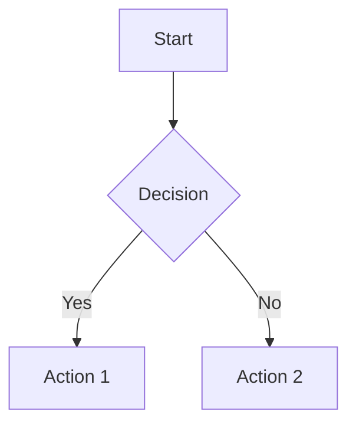

# Using Mermaid Diagrams in Blog Posts

Your site now supports Mermaid diagrams! You can add flowcharts, sequence diagrams, class diagrams, and more to your blog posts.

## How to Use

### Method 1: HTML Div (Recommended)

In your Markdown blog post, use an HTML div with the `mermaid` class:

```html
<div class="mermaid">
graph TD
    A[Start] --> B{Decision}
    B -->|Yes| C[Action 1]
    B -->|No| D[Action 2]
    C --> E[End]
    D --> E
</div>
```

### Method 2: Code Fence (if supported)

Some markdown processors support code fences with `mermaid` language:

````markdown

````

## Supported Diagram Types

### Flowcharts
```html
<div class="mermaid">
graph LR
    A[Square] --> B(Round)
    B --> C{Decision}
    C -->|One| D[Result 1]
    C -->|Two| E[Result 2]
</div>
```

### Sequence Diagrams
```html
<div class="mermaid">
sequenceDiagram
    participant A as Alice
    participant B as Bob
    A->>B: Hello Bob, how are you?
    B-->>A: Great!
</div>
```

### Class Diagrams
```html
<div class="mermaid">
classDiagram
    class Animal {
        +String name
        +int age
        +eat()
        +sleep()
    }
    class Dog {
        +bark()
    }
    Animal <|-- Dog
</div>
```

### State Diagrams
```html
<div class="mermaid">
stateDiagram-v2
    [*] --> Still
    Still --> Moving
    Moving --> Still
    Moving --> Crash
    Crash --> [*]
</div>
```

### Gantt Charts
```html
<div class="mermaid">
gantt
    title Project Timeline
    dateFormat  YYYY-MM-DD
    section Phase 1
    Task 1           :a1, 2024-01-01, 30d
    Task 2           :a2, after a1, 20d
    section Phase 2
    Task 3           :a3, 2024-02-01, 30d
</div>
```

### ER Diagrams
```html
<div class="mermaid">
erDiagram
    CUSTOMER ||--o{ ORDER : places
    ORDER ||--|{ LINE-ITEM : contains
    PRODUCT ||--|{ LINE-ITEM : "ordered in"
</div>
```

## Styling

Diagrams are automatically styled to match your site's dark theme. They will:
- Have a dark background with subtle borders
- Be responsive on mobile devices
- Center-align and scale appropriately

## Documentation

For more diagram types and syntax, visit: https://mermaid.js.org/

